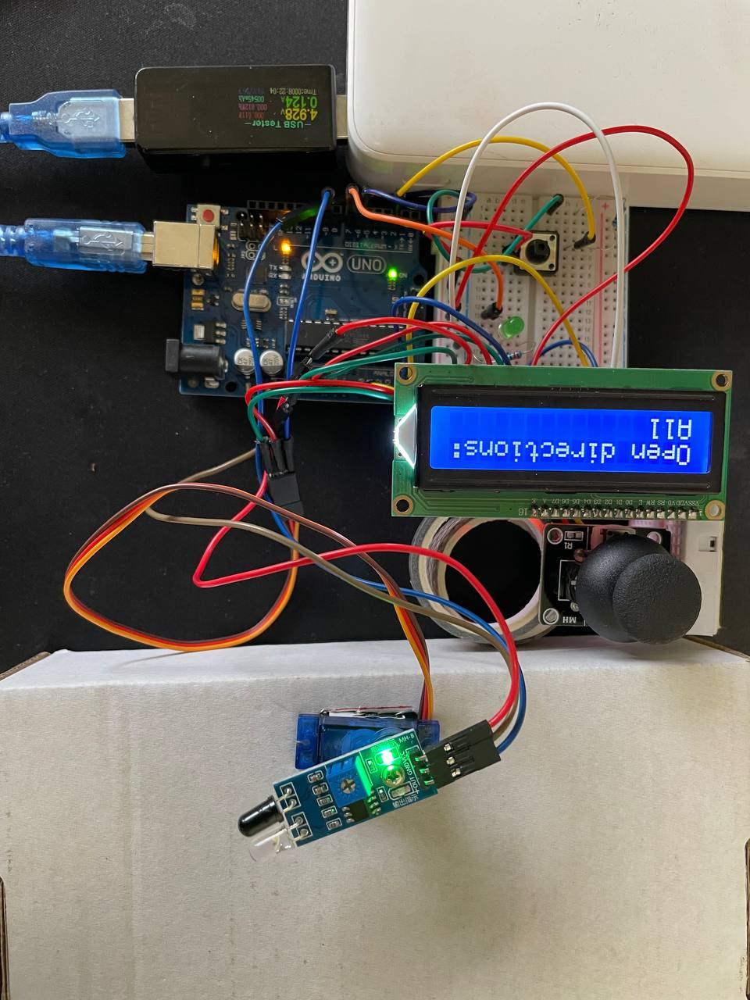
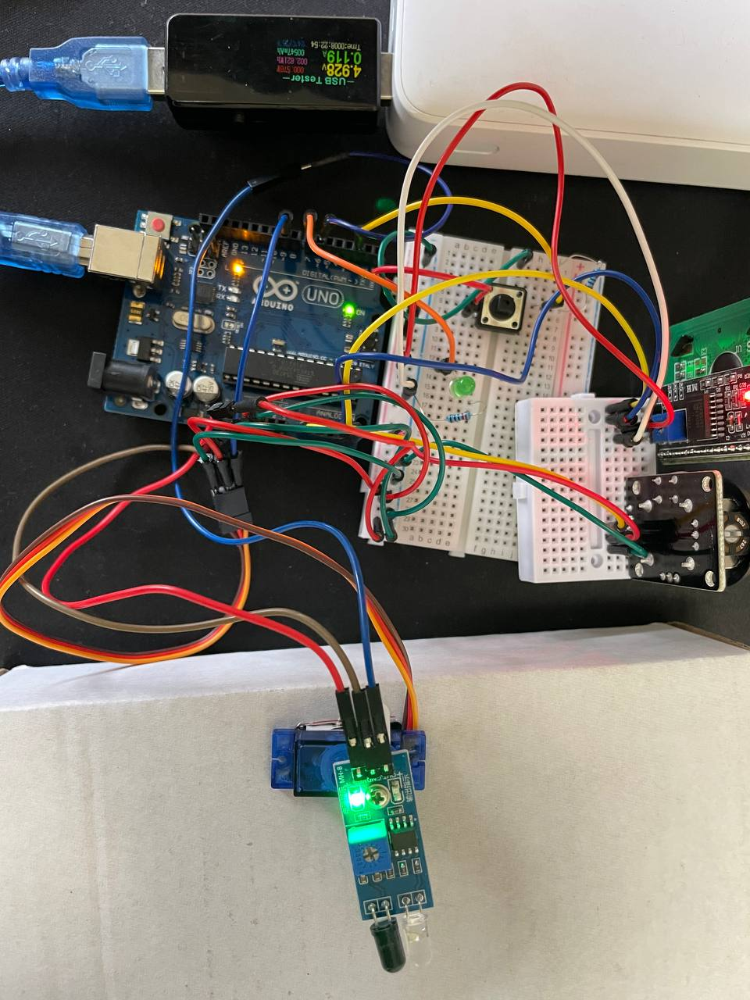
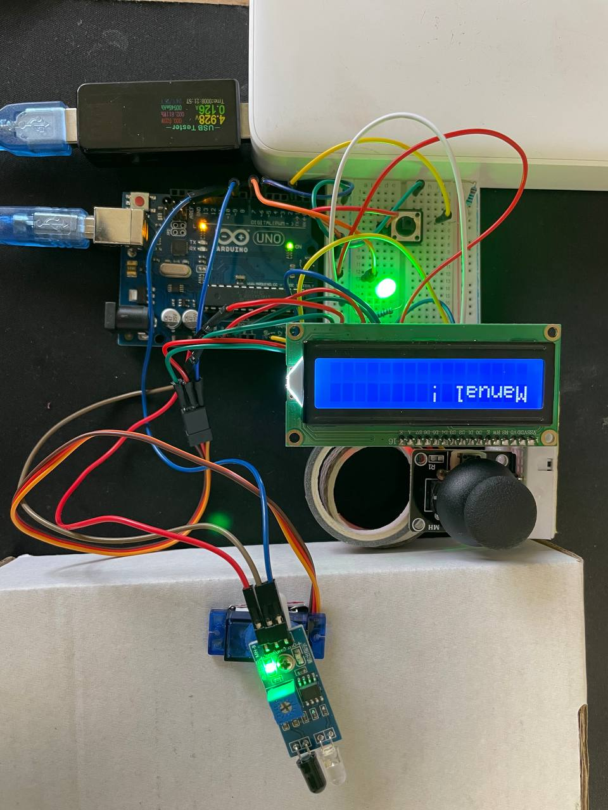

# Radar System Using IRP Sensor and Servo Motor

## Task
```
Use an IR sensor (keyes IR) with a servo motor, the sensor is attached to the motor so that it works as a rotating IR radar, the whole circuit will be inside a 20*20 cm cell and have an opening in one of its walls, your system should have two modes (automatic and manual) and a control bit to choose between the two modes, in automatic mode the system should check and report where is the opening (front, back , left, right ) through serial port to the user every 20 seconds, in manual mode your system should receive commands from the user to check a specific direction and report if its open or close. In both modes the system should display the results on an led module also.
```

## Components

* Arduino Uno
* IR Proximity Sensor
* 16x2 LCD Screen ( I2C )
* Breadboard
* Jumper Wires
* Resistors
* Joystick
* LED
* Push Button

## Circuit Diagram


## Assembled Circuit

<p float="left">
  
   
  
</p>


## Project Demo

<a href="https://www.loom.com/share/7a616d53e18444ff8ba3ff9f494f13c0">
    <p>Watch Demo Video</p>
    
</a>

## IR / Servo Simulation

<a href="https://www.loom.com/share/158c7952658f4c309b3a688b67f5d1ce">
    <p>Protos IR/Servo Simulation - Watch Video</p>
    
  </a>

## Source Code

#### [hw3.ino](hw3.ino)